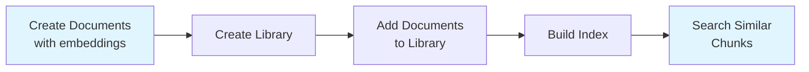
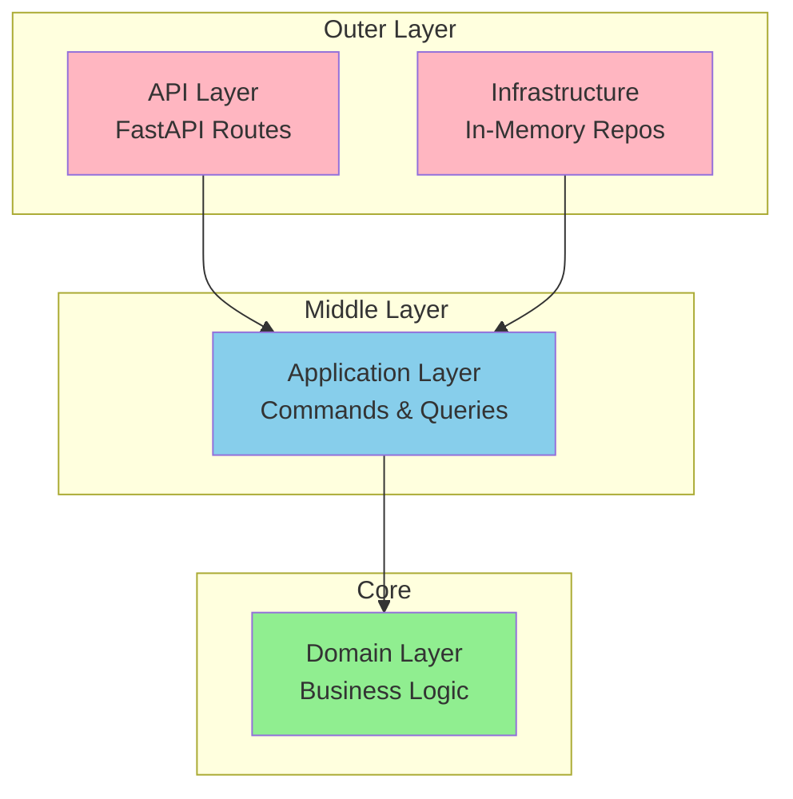

# Vector DB API

> A lightweight, educational vector database REST API built with FastAPI to demonstrate clean architecture and domain-driven design principles.

**What it does**: Store text documents with their embeddings, organize them into libraries, and perform k-nearest neighbor (k-NN) similarity searches using different vector indexing strategies.

**Why it exists**: This project demonstrates production-quality architectural patterns, testing practices, and operational readiness for a moderately complex domain.

## Table of Contents

**Getting Started** (Practical)

- [Quick Start](#quick-start)
- [API Usage](#api-usage)
- [Development](#development)
  - [Running Tests](#running-tests)
  - [Payload Generator Tool](#payload-generator-tool)
- [Configuration](#configuration)

**Understanding the System** (Theoretical)

- [How It Works](#how-it-works)
- [Architecture](#architecture)
  - [High-Level Overview](#high-level-overview)
  - [Domain Model](#domain-model)
  - [Layer Responsibilities](#layer-responsibilities)
  - [Architectural Patterns](#architectural-patterns)
- [Vector Index Implementations](#vector-index-implementations)
- [What's Next?](#whats-next)

---

## Quick Start

**Requirements**: Python 3.13, Docker (optional)

### Option 1: Local Development (Recommended)

```bash
# 1. Create virtual environment
python -m venv .venv
source .venv/bin/activate

# 2. Install dependencies
uv sync

# 3. Run the server
uvicorn app.main:app --reload
```

Visit **http://localhost:8000/docs** for interactive API documentation.

### Option 2: Docker

```bash
# With docker-compose (includes live-reload)
docker compose up --build

# Or manually
docker build -t vector-db-api:local .
docker run --rm -p 8000:8000 vector-db-api:local
```

---

## API Usage

### Key Endpoints

| Method  | Endpoint                             | Purpose                       |
| ------- | ------------------------------------ | ----------------------------- |
| `POST`  | `/documents/`                        | Create a document with chunks |
| `GET`   | `/documents/{id}`                    | Retrieve document details     |
| `POST`  | `/documents/{id}/chunks`             | Add a chunk to a document     |
| `POST`  | `/libraries/`                        | Create a library              |
| `POST`  | `/libraries/{id}/documents/{doc_id}` | Add document to library       |
| `PATCH` | `/libraries/{id}/index`              | Build the vector index        |
| `POST`  | `/libraries/{id}/find-similar`       | Search for similar chunks     |

### Interactive Documentation

Once the server is running, visit:

- **Swagger UI**: http://localhost:8000/docs
- **ReDoc**: http://localhost:8000/redoc

---

## Development

### Running Tests

```bash
# Run all tests
pytest

# Run with less verbosity
pytest -q

# Run specific test file
pytest tests/unit/domain/test_document.py

# Run with coverage
pytest --cov=app --cov-report=term-missing

# Run only unit tests
pytest tests/unit/

# Run only integration tests
pytest tests/integration/
```

**Test Structure**:

```
tests/
├── unit/              # Isolated component tests
│   ├── api/           # API layer tests
│   ├── application/   # Command/query handler tests
│   ├── domain/        # Domain logic tests
│   └── infrastructure/ # Repository tests
└── integration/       # End-to-end API tests
```

### Payload Generator Tool

Generate test data with real Cohere embeddings:

```bash
# Set your API key
export COHERE_API_KEY="your-api-key"

# Generate from file
python tools/payload_generator.py --texts-file data.txt

# Generate from inline text
python tools/payload_generator.py --text "First text" --text "Second text"
```

Outputs document and chunk JSON payloads ready for API testing.

---

## Configuration

### Vector Index Selection

Choose between two indexing strategies using the `VECTOR_INDEX_TYPE` environment variable:

| Implementation        | Query Time   | Build Time | Memory | Best For                                                |
| --------------------- | ------------ | ---------- | ------ | ------------------------------------------------------- |
| **KD-Tree** (default) | O(log n) avg | O(n log n) | O(n)   | Low-dimensional vectors (<20D), read-heavy workloads    |
| **Brute Force**       | O(n)         | O(1)       | O(n)   | High-dimensional vectors, small datasets, exact results |

**Set the configuration**:

```bash
# Use KD-tree (default)
export VECTOR_INDEX_TYPE=kd
uvicorn app.main:app --reload

# Use brute-force
export VECTOR_INDEX_TYPE=brute
uvicorn app.main:app --reload

# With Docker Compose
export VECTOR_INDEX_TYPE=brute
docker compose up --build
```

Alternatively, create a `.env` file (use `.env.example` as template):

```bash
VECTOR_INDEX_TYPE=kd  # Options: kd, brute
```

**Why this matters**: KD-tree offers faster searches for lower-dimensional data but degrades with high dimensions. Brute-force is simpler and guarantees exact results by scanning all vectors.

---

## How It Works

This API follows a simple workflow for vector similarity search:



### Core Concepts

- **Chunk**: A piece of text with its embedding vector and optional metadata (page number, section, etc.)
- **Document**: A collection of chunks representing a single document
- **Library**: A collection of documents with a searchable vector index
- **Vector Index**: Data structure enabling fast k-NN similarity search

### Basic Usage Flow

1. **Create documents** with chunks (text + embeddings)
2. **Create a library** to organize documents
3. **Add documents** to the library
4. **Build the index** to enable searching
5. **Query for similar chunks** using a query embedding

---

## Architecture

### High-Level Overview

The codebase follows **Clean Architecture** with clear separation of concerns:



**Dependency Rule**: Inner layers never depend on outer layers. Domain has zero external dependencies.

### Domain Model

The heart of the application contains pure business logic:

```
domain/
├── documents/
│   ├── document.py          # Aggregate root
│   ├── chunk.py             # Entity
│   ├── document_id.py       # Value object
│   └── document_metadata.py # Value object
├── libraries/
│   ├── library.py           # Aggregate root
│   ├── vector_index.py      # Strategy interface
│   └── indexes/
│       ├── kd_tree_index.py
│       └── brute_force_index.py
└── common/
    └── embedding.py         # Value object
```

**Key patterns**:

- **Aggregates** (Document, Library): Enforce business rules and manage entity lifecycles
- **Value Objects**: Immutable data structures (IDs, embeddings, metadata)
- **Strategy Pattern**: Pluggable vector index implementations

### Layer Responsibilities

#### 1. Domain Layer (`app/domain/`)

**What**: Pure business logic with no framework dependencies
**Contains**: Entities, value objects, aggregates, domain services, repository interfaces
**Example**: `Document.add_chunk()` validates chunk and updates aggregate state

#### 2. Application Layer (`app/application/`)

**What**: Use case orchestration following CQRS pattern
**Contains**: Commands (writes), Queries (reads), handlers
**Example**: `CreateDocumentCommand` validates input, constructs domain entities, saves to repository

**CQRS Pattern**:

- **Commands** (`*_command.py`): Mutate state, validate inputs, coordinate writes
- **Queries** (`*_query.py`): Read-only operations, return DTOs

```
application/
├── documents/
│   ├── create_document_command.py    # Write
│   ├── add_chunk_command.py          # Write
│   └── get_document_query.py         # Read
└── libraries/
    ├── index_library_command.py      # Write
    └── find_similar_chunks_query.py  # Read
```

#### 3. API Layer (`app/api/`)

**What**: HTTP interface using FastAPI
**Contains**: Routers, request/response models (Pydantic), endpoint handlers
**Example**: `POST /documents/` validates request, calls command handler, returns response

#### 4. Infrastructure Layer (`app/infrastructure/`)

**What**: Technical implementations of domain interfaces
**Contains**: Repository implementations, external service adapters
**Example**: `InMemoryDocumentRepository` implements `DocumentRepository` interface with thread-safe storage

### Architectural Patterns

This project combines complementary patterns for maintainability:

#### 1. **Domain-Driven Design (DDD)**

Business logic lives in the domain layer. Entities enforce invariants.

```python
# Domain entities validate business rules
class Document:
    def add_chunk(self, chunk: Chunk) -> None:
        if chunk.id in self._chunks:
            raise InvalidEntityError("Chunk already exists")
        self._chunks[chunk.id] = chunk
```

**Benefit**: Business rules are explicit and testable in isolation.

#### 2. **Clean Architecture**

Layers depend inward. Domain is framework-agnostic.

**Benefit**: Can swap FastAPI for Flask, or replace in-memory storage with Postgres, without touching domain logic.

#### 3. **CQRS (Command Query Responsibility Segregation)**

Writes and reads are separated at the application layer.

**Benefit**: Each operation has a single responsibility. Easy to optimize reads independently from writes.

#### 4. **Vertical Slice Architecture**

Features are co-located while respecting layer boundaries.

```
documents/
├── api/create_document.py
├── application/create_document_command.py
└── domain/document.py
```

**Benefit**: Adding or changing a feature requires minimal cross-cutting changes.

---

## Vector Index Implementations

The API uses the **Strategy Pattern** to support multiple indexing algorithms:

- **KD-Tree** (default): O(log n) average query time, best for low-dimensional vectors
- **Brute Force**: O(n) query time, exact results guaranteed for any dimensionality

See [Configuration](#configuration) section for how to select between implementations.

**Why Strategy Pattern?**: Allows swapping index implementations without changing domain logic. New indexing algorithms can be added by implementing the `VectorIndex` interface.

---

## What's Next?

Potential improvements for production use:

- **Persistence**: SQLite/Postgres repositories for data durability
- **CI/CD**: GitHub Actions for automated testing
- **On-Demand Embeddings**: Generate embeddings via Cohere API instead of requiring pre-computed vectors
- **Authentication**: API key or OAuth2 support
- **Pagination**: Handle large result sets efficiently
- **Background Jobs**: Async index building for large libraries triggered by domain events

---

## Credits

Created by [**Vinícius Albano**](https://github.com/vinialbano) - 2025
